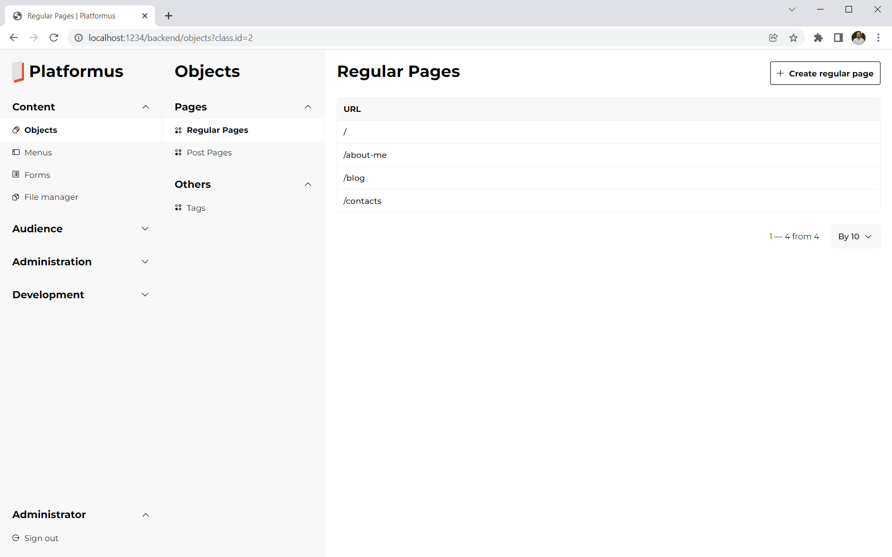
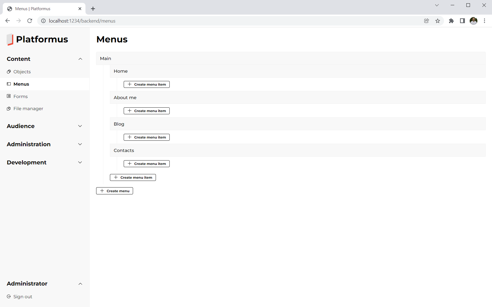

# Platformus 4.0.0

## Introduction

[Platformus](https://github.com/Platformus/Platformus) is free, open source, and cross-platform developer-friendly CMS
based on ASP.NET Core, [ExtCore framework](https://github.com/ExtCore/ExtCore),
and [Magicalizer](https://github.com/Magicalizer/Magicalizer).

It consists of 4 extensions: Core, Website, ECommerce, and Images.

### Core

Provides such basic things like users, credentials, roles, permissions, configurations, and cultures.
Contains default extendable backend UI. Can be used as a base for the mobile application admin panels etc.

### Website

Adds the object-oriented data model (classes, members, objects, properties, and relations to create, edit,
and display content without writing code), menus, forms, and file manager. Completely enough for creating simple websites.

### ECommerce

Implements standard ecommerce features like categories, products, photos, carts, and orders in a very basic way.
Can be used as a starting point for ecommerce projects.

### Images

Provides basic image processing (cropping and resizing).

### Backend UI Screenshots

*Objects Page*

*Edit Object Page*

*Menus Page*

## Getting Started

### Samples

There are few samples:

* [Platformus-Sample-Personal-Website ](https://github.com/Platformus/Platformus-Sample-Personal-Website );
* [Platformus-Sample-Personal-Blog ](https://github.com/Platformus/Platformus-Sample-Personal-Blog );
* [Platformus-Sample-Ecommerce ](https://github.com/Platformus/Platformus-Sample-Ecommerce );
* [Platformus-Sample-Mobile-App-Admin-Panel ](https://github.com/Platformus/Platformus-Sample-Mobile-App-Admin-Panel ).

These samples contain everything you need to build and run Platformus-based web application, including SQLite
database with the test data (and SQL scripts for other supported DB types).

### Tutorials

Documentation contains [several tutorials](http://docs.platformus.net/en/latest/getting_started/index.html)
to help you start developing your Platformus-based web applications.

## Links

Website: http://platformus.net/

Docs: http://docs.platformus.net/

Author: http://sikorsky.pro/
