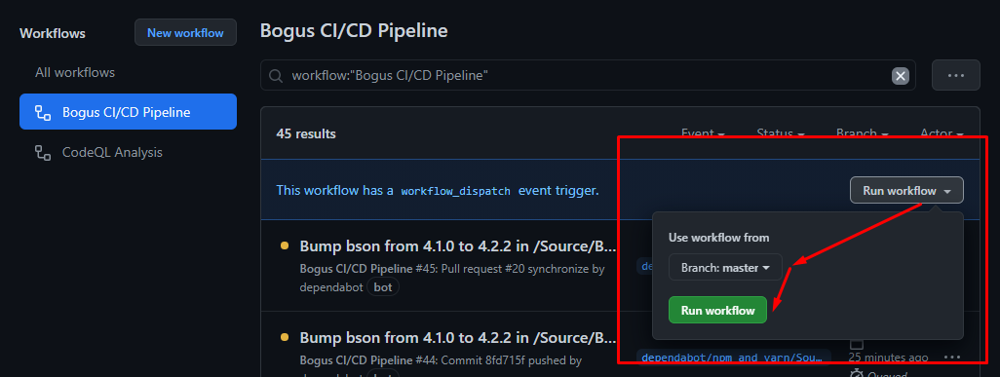

# CI/CD documentation

## 1. Run workflow manually

1. Go to the project's GitHub repository and click on the **Actions** tab

2. From the "Workflows" list on the left, click on "CI/CD Pipeline"

3. On the right, next to the "This workflow has a workflow_dispatch event trigger" label, click on the "Run workflow" dropdown, make sure the default branch is selected (if not manually changed, should be main or master) in the "Use workflow from" dropdown and click the "Run workflow" button

NOTE: **screenshots are only exemplary**

 

## 2. Automated NuGet publishing

To setup the automated publishing to NuGet:

1. Go to the repo **Settings** tab -> **Secrets**

2. Add a secret with the name `NUGET_API_KEY` and as value use an API key from NuGet.org that is assigned to the packages for this project

NOTE: the automated NuGet publishing is execute **only** when a release is triggered by the ["Automated versioning" feature](#3-automated-versioning)

 

## 3. Automated versioning

Automatically bumps up the GitHub tag in the repo and executes the Continuous Deployment job

Note: **not every commit to your default branch creates a release**

Follow these instructions for any commit (push or PR merge) to your default branch, you would like to execute the automated versioning.

You would need one of three keywords at the start of your commit title. Each of the three keywords corresponds to a number in your semantic release version i.e. v1.2.3. The release versioning uses the ["Conventional Commits" specification](https://www.conventionalcommits.org/en/v1.0.0/):

- "fix: ..." - this keyword corresponds to the last number v1.2.**3**, also known as PATCH;
- "feat: ..." - this keyword corresponds to the middle number v1.**2**.3, also known as MINOR;
- "perf: ..." - this keyword corresponds to the first number v**1**.2.3, also known as MAJOR. In addition, to trigger a MAJOR release, you would need to write "BREAKING CHANGE: ..." in the description of the commit, with an empty line above it to indicate it is in the <footer> portion of the description;

Note: when making a MAJOR release by committing through a terminal, use the multiple line syntax to add the commit title on one line, then adding an empty line and then adding the "BREAKING CHANGE: " label
  

#### Examples

Example(fix/PATCH):  
`git commit -a -m "fix: this is a PATCH release triggering commit"`
 
`git push origin vnext`
 
Result: v1.2.3 -> **v1.2.4**
 
 
 
Example(feat/MINOR):  
`git commit -a -m "feat: this is a MINOR release triggering commit"`
 
`git push origin vnext`
 
Result: v1.2.3 -> **v1.3.0**
 
 
 
Example(perf/MAJOR):  
`` git commit -a -m "perf: this is a MAJOR release triggering commit ` ``
 
&gt;&gt;  
&gt;&gt; `BREAKING CHANGE: this is the breaking change"`
 
`git push origin vnext`
 
Result: v1.2.3 -> **v2.0.0**
 
 
Note: in the MAJOR release example, the PowerShell multiline syntax ` (backtick) is used. After writing a backtick, a press of the Enter key should open a new line.

#

Built with ❤ by [Pipeline Foundation](https://pipeline.foundation)
